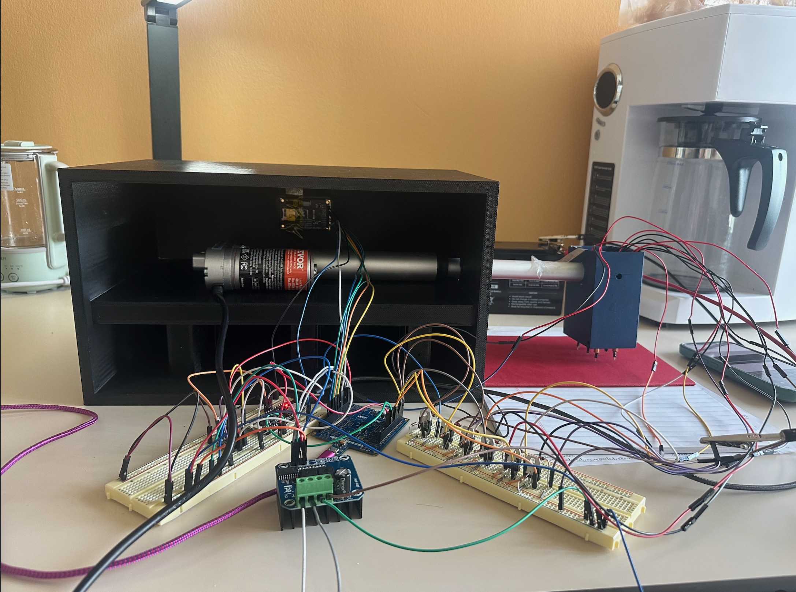
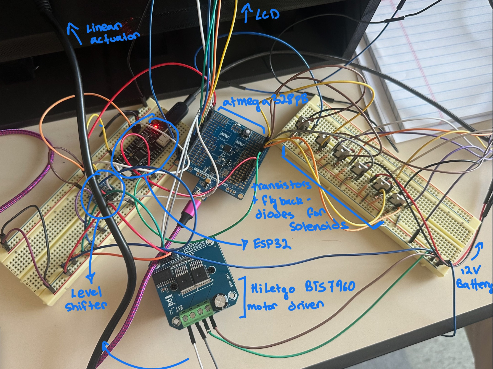
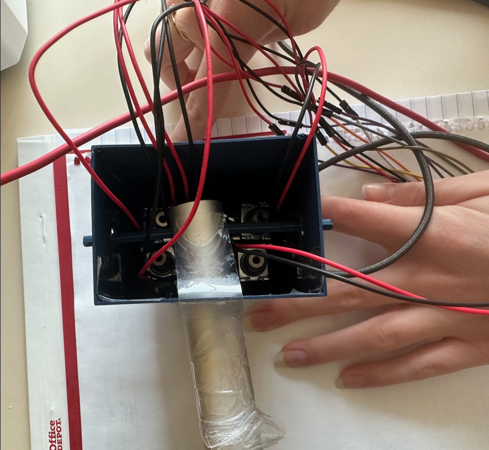
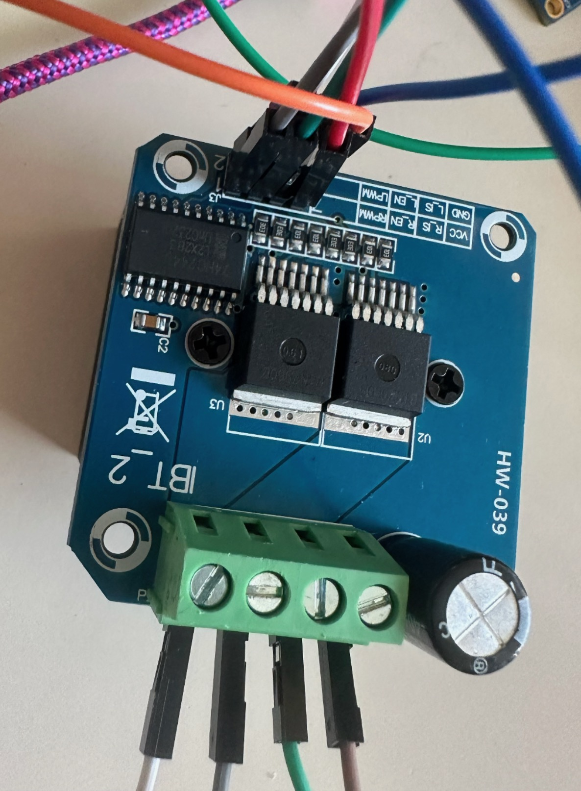
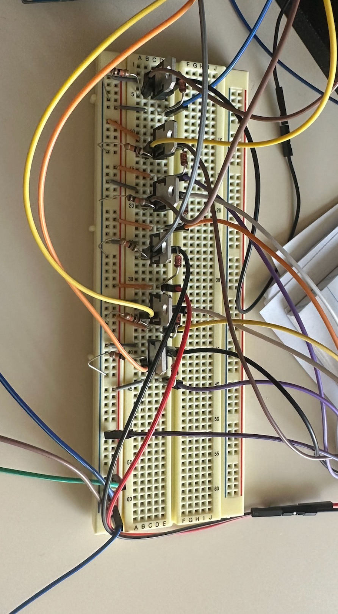
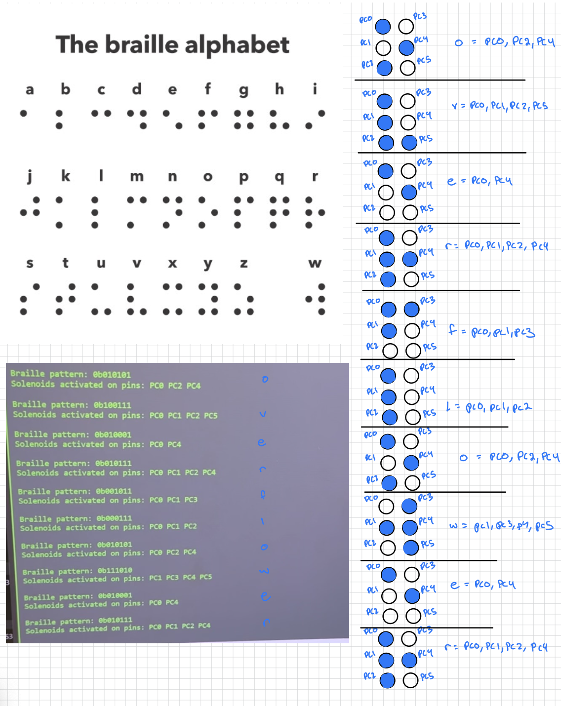

# final-project-skeleton

* Team Number: 14
* Team Name: Stack Overflowers
* Team Members: Sofia Hedlund and Amanda Tapia Garbelloto
* GitHub Repository URL: https://github.com/upenn-embedded/final-project-s25-stack-overflowers.git
* GitHub Pages Website URL: [for final submission]

## Final Project Proposal

### 1. Abstract

*In a few sentences, describe your final project.*

We want to make a braille printer that the user can input text into with a keyboard and have it print out the text into readable braille bumps. We plan to do this by 3D printing braille letters onto a stamp that will then rotated according to the text input and stamped down onto the paper with a motor. This project will use power management, interrupts for reading from the keyboard, and timers to control the stepper motor.

### 2. Motivation

*What is the problem that you are trying to solve? Why is this project interesting? What is the intended purpose?*

The project aims to enhance accessibility for people with reduced vision. By automatically transforming text into braille, people who can't see text are able to expand their integration to reading materials by possessing a personal device that can make any text available for them without requiring extra translators or specialized equipment.

### 3. System Block Diagram

*Show your high level design, as done in WS1 and WS2. What are the critical components in your system? How do they communicate (I2C?, interrupts, ADC, etc.)? What power regulation do you need?*

### 4. Design Sketches

*What will your project look like? Do you have any critical design features? Will you need any special manufacturing techniques to achieve your vision, like power tools, laser cutting, or 3D printing?*

We will need to 3D print the braille stamp to attach to the motor and also need some kind of container to hold the LCD and the wiring needed to power the system. We will also have to 3D print a stand to hold the linear actuator.

### 5. Software Requirements Specification (SRS)

*Formulate key software requirements here. Think deeply on the design: What must your device do? How will you measure this during validation testing? Create 4 to 8 critical system requirements.*

*These must be testable! See the Final Project Manual Appendix for details. Refer to the table below; replace these examples with your own.*

**5.1 Definitions, Abbreviations**

Here, you will define any special terms, acronyms, or abbreviations you plan to use for hardware

PWM- Pulse Width Modulation

ASCII- American Standard Code for Information Exchange

LCD- Liquid Crystal Display

**5.2 Functionality**

| ID     | Description                                                                                                                                                                                                                                                                               |
| ------ | ----------------------------------------------------------------------------------------------------------------------------------------------------------------------------------------------------------------------------------------------------------------------------------------- |
| SRS-01 | The microcontroller will process each letter of the text input and connect it to its corresponding braille. We can test its accuracy by plugging in sample characters and evaluating the different outputs of the MCU.                                                                    |
| SRS-02 | The system will translate each recognized letter into a PWM signals sending specific rotation angle for the Braille stamp mechanism, ensuring accurate letter selection. In this phase, we can actually measure the rotation angle for each character once we have our stamper connected. |
| SRS-03 | The stamping should be precisely timed, ensuring that the stepper motor finishes its rotation completely before the stamp is pressed again to prevent misalignment.                                                                                                                       |
| SRS-04 | The linear actuator will move the stamping mechanism, positioning the stamp at the correct location on the paper. The actuator should only move the stamp after it is pressed.                                                                                                            |
| SRS-05 | The software will have debouncing to filter out noise from the keyboard.                                                                                                                                                                                                                  |

### 6. Hardware Requirements Specification (HRS)

*Formulate key hardware requirements here. Think deeply on the design: What must your device do? How will you measure this during validation testing? Create 4 to 8 critical system requirements.*

*These must be testable! See the Final Project Manual Appendix for details. Refer to the table below; replace these examples with your own.*

**6.1 Definitions, Abbreviations**

Here, you will define any special terms, acronyms, or abbreviations you plan to use for hardware

Stepper Motor- DC motor that has very precise conotrol that will help us avoid error when rotating the stamp to the position of the letter.

Linear Actuator- Moves in a straight line so that we can move the stamp up and down.

**6.2 Functionality**

| ID     | Description                                                                                                                                                                                                                                                                       |
| ------ | --------------------------------------------------------------------------------------------------------------------------------------------------------------------------------------------------------------------------------------------------------------------------------- |
| HRS-01 | The device will require a keyboard module for text entry, this will communicate with the ATmega238 via PS/2.                                                                                                                                                                      |
| HRS-02 | It will also display the typed text to a LCD screen (I2C interface) to provide user feedback before printing. We will test the keyboard and the screen by seeing whether the later is displaying the correct keyboard inputs in real time.                                        |
| HRS-03 | The MCU will generate a PWM signal to control a stepper motor, which will rotate the Braille stamp mechanism to the correct character position. While working on this part we will ensure that the PWM signals are accurately rotating the stamp with a negligible error accuracy |
| HRS-04 | A linear actuator will move the stamp up and down to imprint the letters on to the paper A motor driver will be used to control the linear actuator, ensuring reliable movement without overloading the MCU.                                                                      |
| HRS-05 | The power system will need 12V power source and a buck converter for 5V to power the MCU, LCD, Stepper, and Linear Actuator.                                                                                                                                                      |

### 6. Bill of Materials (BOM)

*What major components do you need and why? Try to be as specific as possible. Your Hardware & Software Requirements Specifications should inform your component choices.*

*In addition to this written response, copy the Final Project BOM Google Sheet and fill it out with your critical components (think: processors, sensors, actuators). Include the link to your BOM in this section.*

The major components that we need are a stepper motor/driver to spin the braille stamp and a linear actuator/driver to move the stamp up and down. We chose our stepper motor in order have a lot precision over the amount of degrees the motor turns, so that the correct braille letter is stamped. We also chose for it to be 12V in order to ensure that it will have enough torque required to spin the braille stamp accurately. The driver will let us send simple STEP and DIR signals to control the stepper which will help us easily control the stepper. We chose a linear actuator to stamp down and a H-bridge so that we can move the actuator both up and down. Our budget was a main factor in choosing our linear actuator, because a lot of them were quite pricey (around 70$), so we chose the most affordable option we could find that fit with our system. We chose our keboard to be able to communicate over PS/2 because it is simpler to work with then USB communication which would likely need outside libraries. We will also use the LCD screen from Lab 4 and use the ATmega328Pb Xplained mini board.

[BOM](https://docs.google.com/spreadsheets/d/10AtQ8pPZeS8G-I5d4TY12WMqAhfvfrOR0J54DZgVhsI/edit?usp=sharing)

### 8. Final Demo Goals

*How will you demonstrate your device on demo day? Will it be strapped to a person, mounted on a bicycle, require outdoor space? Think of any physical, temporal, and other constraints that could affect your planning.*

We will demonstrate our device on demo day by entering in text to the keyboard, which will then be displayed on the LCD and then printed in braille by the stepper motor which will rotate to position the correct letter and the linear actuator which will stamp it down. Some physical constraints are that we need to have enough table space for the keyboard, LCD container, stepper motor, and paper. Because we are stamping the text out letter-by-letter, printing out a word or a short phrase will be more realistic to demonstrate out project without excessive time delay. At the end of the demo, the user can feel the braille stamped out on the paper, and can also compare it against the text on the LCD.

### 9. Sprint Planning

*You've got limited time to get this project done! How will you plan your sprint milestones? How will you distribute the work within your team? Review the schedule in the final project manual for exact dates.*

| Milestone  | Functionality Achieved                                                                                                                                    | Distribution of Work                                                                                                                      |
| ---------- | --------------------------------------------------------------------------------------------------------------------------------------------------------- | ----------------------------------------------------------------------------------------------------------------------------------------- |
| Sprint #1  | -3D print braille stamp -Create rotating code for the stamp that maps characters to braille positions                                               | 3D printing- Amanda Code- Sofia                                                                                                      |
| Sprint #2  | -Add keyboard/LCD screen that displays the input text -3D print stand for the linear actuator and stepper -Debug rotation issues with the stamp | Keyboard/LCD- Sofia 3D print- Amanda  Debug- both                                                                              |
| MVP Demo   | -Create code to move linear actuator up and down -Debug movement with linear actuator                                                                | Code/movement- both                                                                                                                       |
| Final Demo | -Refine precision of the motor movements                                                                                                                 | Both**This is the end of the Project Proposal section. The remaining sections will be filled out based on the milestone schedule.** |

## Sprint Review #1

### Last week's progress

During this sprint, we finished the code to connect the serial terminal to the LCD screen so that it displays the text the user inputs. We also implemented the logic behind mapping the characters to their braille representations in binary, and the code to turn the pins the solenoids will be attached on to HIGH. We also started CAD for the structure that will hold the solenoids above the paper. We have committed the code for this part on github.

### Current state of project

After the project presentation we got some feedback from the class on how to improve the stamping mechanism, so instead of using a wheel we will be working with six solenoids to support the full braille pattern.

We also took the professor's advice and are using our serial terminal to type out what we want to be translated to braille, instead of connecting another keyboard.

So, for each letter typed into the terminal, we have built the code that is recognizing them and translating it to the braille pattern, relating each dot to its correspondent solenoid and activating them. Since our parts have not arrived we still haven't tested their functionality, but so far our printed results seem to be in order. We have also wired the LCD screen and tested that it correctly displays what is being typed.

We have now ordered all the hardware parts needed for the project, but they haven't been delivered yet, so we are hoping to have them by next week so that we can also put them together with the stands we are designing and 3D printing. We have started working on the CAD structures for our supports and are planning on printing them this next week.

### Next week's plans

Next week we are going to be working on the hardware and testing the actual implementation of our code to the devices as soon as they arrive. So far we have the code for the solenoids push and pull, however since they were ordered later, we are probably going to implement first the movement of the linear actuator, which should follow the x-axis from right to left (since we are going to be stamping upside down).  Sofia will be working on combining the software and the hardware and debugging any issues that come up which will take around 5 hours, and will be considered “done” once the solenoids correctly move up and down with the character inputs and the linear actuator is able to move corresponding to each character.

We are also going to use the 3D printers to build the support for the solenoids and the box to keep most of our hardware connections, including the breadboards and ATmega238. Amanda will be working on 3D printing these supports with SolidWorks, which we are estimating will take around 5 hours and will be considered “done” once we send off the print request.

## Sprint Review #2

### Last week's progress

The solenoids that we ordered came, so we wired them with diodes and transistors and connected them to our MCU. From there, we debugged some issues with them correctly moving in and out, and realized two out of the six solenoids didn’t work properly, so we will be reordering them. We also completed and submitted CAD designs for a structure to hold the linear actuator and breadboard and also a structure to hold the actual solenoids.  We put the CAD files and a[ video](https://drive.google.com/file/d/1jELO6MgL8OEqHJt7nowW01g8Ehbm2qYE/view?usp=sharing) of the solenoids working with text input in the repo.

### Current state of project

At this point, we can see the braille patterns pretty accurately and have the LCD display our words at the same time as each letter is translated. We have wired part of the hardware and now need to add the linear actuator so that the motor moves on the x-axis as it prints on paper. We are waiting for the 3D printer to assemble all pieces and verify that they are the expected and can support our hardware accordingly.

### Next week's plan

Next week, we hope to figure out a way to attach a structure onto the tops of the solenoids so that when they move up and down they will stamp braille in the correct standardized dimensions. We also hope to get the linear actuator to work and move correctly as letters are stamped down. If the 3D print jobs are completed, we will also work on assembling the parts together.

We are planning on working together on most goals for next week, getting the linear actuator to work and debug any problems we might find with it should take around 4 hours to get the motor working and 3-5 hours for an attachment to the solenoids depending on how we implement it. Assembling the 3D pieces together should be pretty straightforward, but if we need to fix something or maybe redesign it, it might take up to 3 hours.

If everything works correctly, we also want to implement a feature connecting the braille machine to the blynk app, using the ESP32 interface so that we could try typing in our phones and getting the physical braille output.

## MVP Demo

1. Show a system block diagram & explain the hardware implementation.

   
2. Explain your firmware implementation, including application logic and critical drivers you've written.

   Our firmware currently takes in input using UART from the computer keyboard and converts it to bit representations of the Braille patterns. With these, it moves the solenoids up and down and the linear actuator right and left in order to create printed Braille. Using the UART driver, we store string inputs in a buffer and then process the string character-by-character by looking up the corresponding 6-bit Braille pattern from our table. In the bit representation, it will be a 1 if there is a bump and a 0 if there is no bump for each of the six Braille cells. These bits are then mapped to the six GPIO pins on our AtMega that control the solenoids in the activate_solenoids() function which sets and clears these pins with delays for stamping. We also have the functions actuator_move_out() and actuator_move_in() that control the GPIO pins to control the actuator for each character stamped out. The actuator moves out in between each character, and then will reset to the beginning of the line (moving in) for any new input, line overflow, or screen overflow. We also update an LCD screen in real-time as each character is stamped out so the user knows what is being written.
3. Demo your device.

   [https://drive.google.com/file/d/1WyQ7toSs-Gw57tEabU6b0ifRRfPq295w/view?usp=drivesdk](https://drive.google.com/file/d/1WyQ7toSs-Gw57tEabU6b0ifRRfPq295w/view?usp=drivesdk)

   [https://drive.google.com/file/d/1pV1rKBUoVU073-nwK2HYLF4Z8lEnAvDB/view?usp=drivesdk](https://drive.google.com/file/d/1pV1rKBUoVU073-nwK2HYLF4Z8lEnAvDB/view?usp=drivesdk)
4. Have you achieved some or all of your Software Requirements Specification (SRS)?

   1. Show how you collected data and the outcomes.
   2. We are using the LCD screen, which communicates over SPI, in order to display our typed inputs into the serial terminal. The screen shows our written words correctly and the linear actuator moves forth with each character and back at every new line to start typing the next input.
   3. Our motor and solenoids are also driven by GPIO. We changed our initial implementation, so we no longer needed to use PWM signals in order to rotate a stepper motor and instead are using GPIO to set the solenoids high or low according to our pattern.
   4. The timing precision of the machine has also been working reasonably well. We move the linear actuator after stamping each letter and then activate the solenoids. When a new input is written, representing a new line on the LCD, the actuator moves fully back and restart by the beginning of the line. We can still try to work on the precision of the movements, changing delays for example, but overall our system is working as expected.
5. Have you achieved some or all of your Hardware Requirements Specification (HRS)?

   1. Show how you collected data and the outcomes.
   2. We changed the interface of our input communicating tot he ATMega, so instead of a separate keyboard we are using the serial terminal connection (UART) from our laptops to the MCU and LCD display, which has been working accordinly.
   3. Our linear actuator and solenoids (stamping machine itself) are moving as expected. The linear actuator moves in the x-axis at every character and the solenoids are activated when it is no longer moving.
   4. We are using two different power sources. The Linear Actuator and the solenoids need 12V, so we ordered a battery to provide enough voltage and since the actuator also draws significant current (5A) we looked for a 12V battery with 7A current to support the actuator plus the six solenoids.
6. Show off the remaining elements that will make your project whole: mechanical casework, supporting graphical user interface (GUI), web portal, etc.

   We are still waiting to get our mechanical support for the linear actuator from the 3D printer. This element will be the overall case for the entire system and will provide a place to place the ATmega238 along with the breadboards. Internaly the box will also have a shelf to support the linear actuator, with a hole to the side were the moving part of our actuator will come out and move along the paper. This part of the linear actuator will also be propoerly connected to a solenoid support, where our six solenoids will be held in the right braille position and the bottom of each solenoid will be attached to a spike to poke the braille with correct pattern.

   In the firmware we will also finish implementing the connection between the feather and the serial terminal through UART so that we can use our phones to type our inputs. We will also work on debugging the current code and correcting any errors or delays which might be causing some unsynchronized movement between the solenoids and the actuator.

   We are still need to create a web portal for the project and add its link to our repo.
7. What is the riskiest part remaining of your project?

   The riskiest remaining part of our project is attaching parts to the tops of the solenoids so that we are able to print braille in the correct standard size/format. Because the solenoids are bulky currently, we need to design and apply attachments to each solenoid that will allow them to stamp in the braille with correct spacing to be readable.
   We also looked up the standard size of braille and are thinking of scaling it by 2 for making the stamp more visible and easier to manage due to our solenoid size and distance.

   1. How do you plan to de-risk this?

      We plan to de-risk this by properly trying out different materials that we can use to stamp down, such as 3D printing or rubber tips, and we will try attaching them in multiple ways to make sure that they are stable. We will also test out our braille stamp options on the braille paper, and adjust the stamping pressure with the solenoids depending on the results.
8. What questions or help do you need from the teaching team?

   We mostly need to continue debugging the motion of the linear actuator and finish assembling it with the 3D printed parts. We also hope to integrate it with the feather and the Blynk app which we could need some support with.

   From our last try, we were able get the inputs from the Blynk app to the serial terminal of the arduino, however, we still can't transmit the strings through UART to the LCD, so we will most likely go to office hours this week to finish this implementation.

## Final Project Report

Don't forget to make the GitHub pages public website!
If you’ve never made a GitHub pages website before, you can follow this webpage (though, substitute your final project repository for the GitHub username one in the quickstart guide):  [https://docs.github.com/en/pages/quickstart](https://docs.github.com/en/pages/quickstart)

### 1. Video

[Insert final project video here]

* The video must demonstrate your key functionality.
* The video must be 5 minutes or less.
* Ensure your video link is accessible to the teaching team. Unlisted YouTube videos or Google Drive uploads with SEAS account access work well.
* Points will be removed if the audio quality is poor - say, if you filmed your video in a noisy electrical engineering lab.

### 2. Images

  
  
    
  
  

*Include photos of your device from a few angles. If you have a casework, show both the exterior and interior (where the good EE bits are!).*

### 3. Results

*What were your results? Namely, what was the final solution/design to your problem?*

Our proposal was to make braille printing more accessible and cheaper. From our final implementation we could design a stamping machine responsible for translating our typed inputs from our phones  sent through the  esp interface. We were able to build a reasonably functioning machine, which correctly related the inputs to the output pattern and activated solenoids responsible for stamping each respective character. Our linear actuator moves out after each letter is stamped and after a character count, when it reaches its maximum extended length, goes back in to restart and write on another line. We were able to implement both paths, having the actuator start untextended and move out, as well as having it move right to left (going from fully extended to its original length), which would be a more accurate representation of braille, since the stamping of the paper would happen upside down and required us to mirror all letters when accommodating the solenoids on their box.

We ran into a few problems when actually testing our stamp. We attached spike metals to the bottom of each solenoid (which proved pretty challenging),  so that they would poke the paper. But even  after we were able to have them fixed, the fact that we couldn't control the pressure of their stamps made it pretty hard to see what was being printed. We attempted using carbon paper to have a better result, but still couldn't make out the dot pattern in the paper, only a few scratches and dots. Another challenge was setting the solenoid box straight so that it wouldn't bend over one of the sides. Since our solenoid box was attached to the head of the linear actuator, it tilted on one side and this changed the direction of the stamps being activated, as well as the height at which we should position our paper. For these main hardware issues we weren't able to validate precisely our printed results on paper, but still had the software and electrical hardware working according to the expected, which should overall work for our primary purpose.

#### 3.1 Software Requirements Specification (SRS) Results

*Based on your quantified system performance, comment on how you achieved or fell short of your expected requirements.*

We could correctly program the firmware to recognize each character we put on the terminal and relate it to a specific braille pattern. We changed our implementation from using a rotation stamping moving up and down to a solenoid stamp, so we weren't required to implement PWM signals and used simply GPIO to control the activation of the solenoids and the linear actuator. In this case, instead of  measuring the precision of our design by having the right timing for the stepper and servo motor to move, we assured that our linear actuator started either fully extended or fully retracted at the beginning of each input and that it stopped when the solenoids were activated to stamp the paper and moved again after each character. We calculated the delay for separating each stamp and defined the maximum characters that would be in one line so that when that limit was reached the linear actuator would automatically go back to its initial placement.

For our serial communication requirement, we used SPI for the LCD screen, which displayed each character correctly as it was being stamped. We also implemented UART by connecting the ESP32 to the blynk app to capture the inputs out from our phone instead of only using only the serial terminal on our laptops.

*Did your requirements change? If so, why? Failing to meet a requirement is acceptable; understanding the reason why is critical!*

Even though we were only physically connected to PD0 with the ESP32, we found that sharing the USART0 interface between application data (from the ESP) and debug output (sent from the mcu to the terminal) caused interference. Our most logical explanation is that the bidirectional UART, as well as its buffers and timing must be synchronized in showing and receiving inputs and outputs. In this case when the ESP and the terminal tried to send signals and display the output from the mcu,  sharing a single USART resource, the serial communication broke down. Disconnecting the ESP from PD0 resolved the issue, and allowed us to receive the inputs from the laptop again, confirming that PD0 was being affected logically by the shared UART, not electrically. However, since our main goal was to be able to use the blynk interface, we chose to keep the wire plugged in and make full use of the ESP, disconnecting the serial terminal from our browser. We were also able to implement interrupts instead of pooling to capture the signals sent by UART to the mcu, however this implementation proved a bit tricky because we believe our debug statements to have interfered with the communication, in a way that although the hardware worked, we were not able to prove the accuracy of our results through the statements. Therefore we moved back to our previous approach and got to observe the response for every input sent

Some of our requirements did change from the moment we decided to take the approach of using solenoids instead of a rotating stamping machine, like changing from pwm to GPIO, and adapting the movement of the linear actuator to the x-axis. At the end, we also changed a bit of our logic, testing whether we should have the actuator fully extended or not at first and how much it should be extended even at its lowest point to fit our Solidworks design.

*Validate at least two requirements, showing how you tested and your proof of work (videos, images, logic analyzer/oscilloscope captures, etc.).*

| ID                | Description                                                                                                                                                                                                            | Validation Outcome                                                                                                                                         |
| ----------------- | ---------------------------------------------------------------------------------------------------------------------------------------------------------------------------------------------------------------------- | ---------------------------------------------------------------------------------------------------------------------------------------------------------- |
| SRS-01            | The microcontroller will process each letter of the text input and connect it to its corresponding braille. We can test its accuracy by plugging in sample characters and evaluating the different outputs of the mcu. | Confirmed with print statements sent to the terminal and by showing the activation of each solenoid. Image below                                          |
| SRS-04            | The linear actuator will move the stamping mechanism, positioning the stamp at the correct location on the paper. The actuator should only move the stamp after it is pressed.                                         | Confirmed by the output. Here is a [link](https://drive.google.com/file/d/1Mm9ABieJjgD0r2lmUwMEIsag-uQJrzTZ/view?usp=sharing) to the linear actuator moving. |
| Image for SRS-01: |                                                                                                                                                                                                                        |                                                                                                                                                            |

  

#### 3.2 Hardware Requirements Specification (HRS) Results

*Based on your quantified system performance, comment on how you achieved or fell short of your expected requirements.*

Overall we achieved most of our goals, having the printer process inputs as expected and our actuator and solenoids move accordingly. We encountered some difficulty in controlling the pressure that the solenoids would be pressed in the paper, making it somewhat difficult to see the stamping outcomes. We 3D printed our structure supporting the linear actuator and with enough space to also hold the breadboards and wires, as well as a smaller box holding the solenoids. Our bigger box had a space for our LCD screen, which correctly showed each character being stamped through SPI. The thickness of our box was bigger than we expected so when we changed our code so that the actuator never moved fully back in. Even when starting at the most retrieved position, the actuator was already slight extended making sure that the solenoid box was still properly attached to it, we recalculated the space it should move after each character and made sure that the actuator was only active after the solenoids were activated to ensure precise stamping.

*Did your requirements change? If so, why? Failing to meet a requirement is acceptable; understanding the reason why is critical!*

A few of our original ideas of implementation changed before we actually built the project. Following feedback from the professor, our first change was to use the serial terminal and UART communication from our own laptops as the inputs for the typed words.

Our initial idea also involved using a stepper motor to rotate a wheel machine which would move both horizontally and vertically to stamp each letter. From talking to our classmates we got feedback on how to simplify our mechanism using a set of six solenoids and our linear actuator to move horizontally on our paper and activate the precise solenoids to create the accurate letter. In this case, we were also able to work mainly with GPIO to activate the solenoids  instead of needing PWMs to rotate the wheel and could be more precise with the timing and spacing of the stamping.

On the practical side, we encountered a few issues in attaching a spike structure to the bottom of the solenoids and positioning them closer so that they would resemble a normal braille size. At the end, we were able to superglue pointy structures to the solenoids to punctuate the bottom of the paper, although the light pressure didn't allow us to see the correct pattern on paper.

We powered our 12V components through a battery but ended up not using a buck converter to step it down to 5V. Instead we used the ATmega output for 5V, but still had to shift down the voltage to 3.3 using the level shifter so that we could connect the ESP32. The device might also not be considered portable due to the size of the main box, however it would be perfectly plausible for each household with a visually disabled person to acquire and learn how to use one for a fairly cheap price.

*Validate at least two requirements, showing how you tested and your proof of work (videos, images, logic analyzer/oscilloscope captures, etc.).*

| ID     | Description                                                                                                                                                                                                                                                                                    | Validation Outcome                                                                                                                                                                                                                                                                                                                                                                                                                                         |
| ------ | ---------------------------------------------------------------------------------------------------------------------------------------------------------------------------------------------------------------------------------------------------------------------------------------------- | ---------------------------------------------------------------------------------------------------------------------------------------------------------------------------------------------------------------------------------------------------------------------------------------------------------------------------------------------------------------------------------------------------------------------------------------------------------- |
| HRS-02 | It will also display the typed text to a LCD screen (I2C interface) to provide user feedback before printing. We will test the keyboard and the screen by seeing whether the later is displaying the correct keyboard inputs in real time.                                                     | Confirmed as observed in video. Each character appears on the screen simultaneously as its being printed. Here is a[link](https://drive.google.com/file/d/1S9dsCvcRlnqZN1PVkVOyjlvBThYYR3gt/view?usp=sharing) to the video.                                                                                                                                                                                                                                   |
|        |                                                                                                                                                                                                                                                                                                |                                                                                                                                                                                                                                                                                                                                                                                                                                                            |
| HRS-04 | The motor will be mounted on a linear actuator, allowing it to move up and down (for stamping) and along the X-axis (for letter placement), working similarly to a plotter. A motor driverwill be used to control the linear actuator, ensuring reliable movement without overloading the MCU. | Partially confirmed. We used the linear actuator to move only in the x-direction, which worked precisely in timing and consistency with the motor driver. For the stamping up and down we used solenoids, connected and activated by the mcu and using diodes as a way to protect them from high voltages spikes as the motor turns off.  Here is a [link](https://drive.google.com/file/d/1oe5jddUY3IOjdkLFp_U5J3e_CTjTlkMo/view?usp=sharing) to the video. |

### 4. Conclusion

Reflect on your project. Some questions to address:

* What did you learn from it?
* What went well?
* What accomplishments are you proud of?
* What did you learn/gain from this experience?
* Did you have to change your approach?
* What could have been done differently?
* Did you encounter obstacles that you didn’t anticipate?
* What could be a next step for this project?

Our project went through many changes along the way, initially we thought of having a rotating stamp with alphabet characters and control two motors, a stepper motor through pwm to rotate the stamp and a servo motor through GPIO to move it up and down stamping the paper. By receiving feedback from the professor, the teaching team and our classmates we changed our implementation to receive the inputs directly from UART to the MCU and  created our braille pattern in solenoids which would automatically stamp the paper when activated, printing each letter.

This was one of our first times building an actual project from scratch and being responsible for all the design and implementation options. In the beginning, we were very cautious to understand what each component actually needed to do and how we would connect all elements both in hardware and software to reach our desired result. From software and hardware intersection in planning how to detect new inputs and activate our motors and solenoids precisely, to more hardware focused issues in finding an ideal battery for our 12V components and maximum current drawn, as well as building the structures to move our parts accordingly, and using solidworks to design the support for our components. We learned how to plan ahead and think of alternative solutions in case we forgot any small detail impacting our performance or had any pieces break or did not arrive in time.

Our final result was close to what we expected; we successfully implemented the UART for both our serial terminal and using the blynk application, which allowed us to type our inputs on our phones. We also were able to recognize each character and associate them to a pattern activating the solenoids through GPIO. And our actuator worked precisely after the stamps, leaving a standard space between each letter and going back to its original position at the start of each input, representing a new line. However, we encountered some problems with the actual stamp, while attaching structure to the bottom of the solenoids. Maybe a better solution would have been to print press fit structures and attach them to the solenoids, leading our spikes to the center of the solenoid holder so as to decrease the size of each character.

A next step for the project could be implementing another linear actuator responsible for moving in the y-direction, so that each new line would automatically start below the current one. In this case, we would have a real plotter stamping braille texts fully automatically. Another implementation would be scaling precisely the size of the characters by attaching structures to the bottom of the solenoids, centering the spiking stamps along the middle of the bottom of the solenoid box, making each stamp smaller and more realistic. In this case, the timing for extending the actuator would also change, so that the spacing between characters would be precisely scaled with their size. This would make the final machine more useful for actual applications by families or industries, being completely autonomous and standardized.

## References

LCD Library (Lab 4: Pong)

UART files from previous labs and ws.
