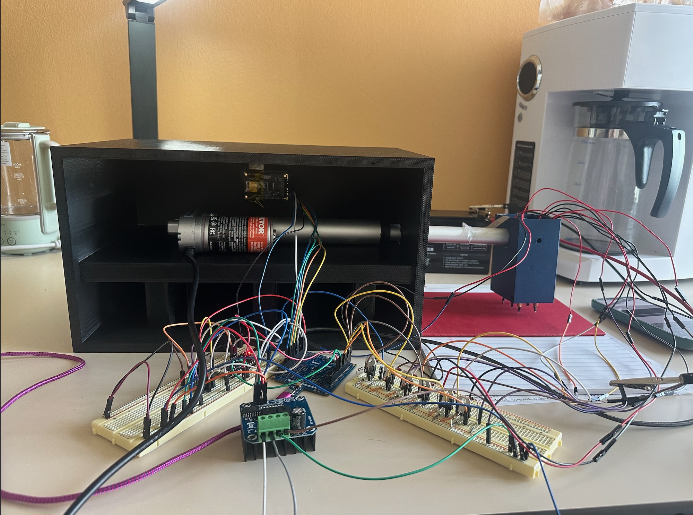
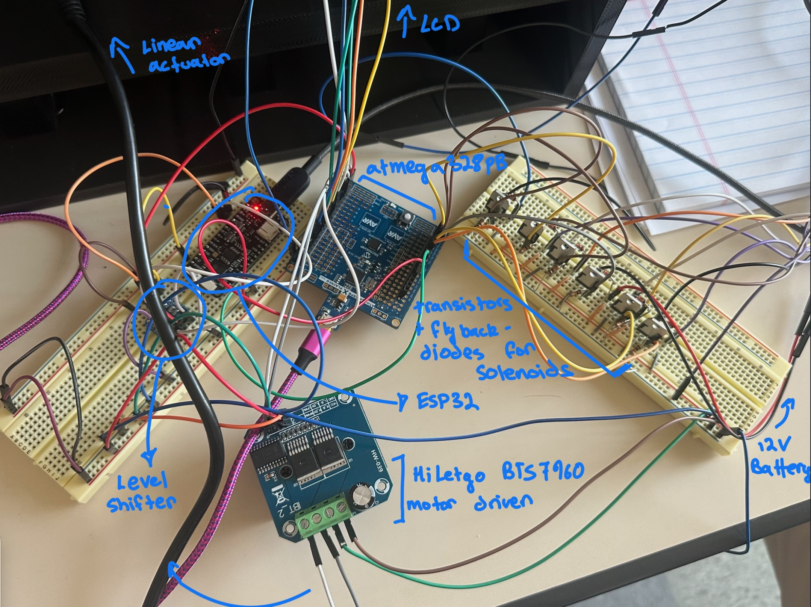
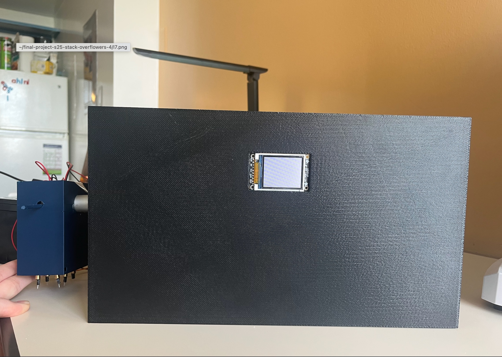
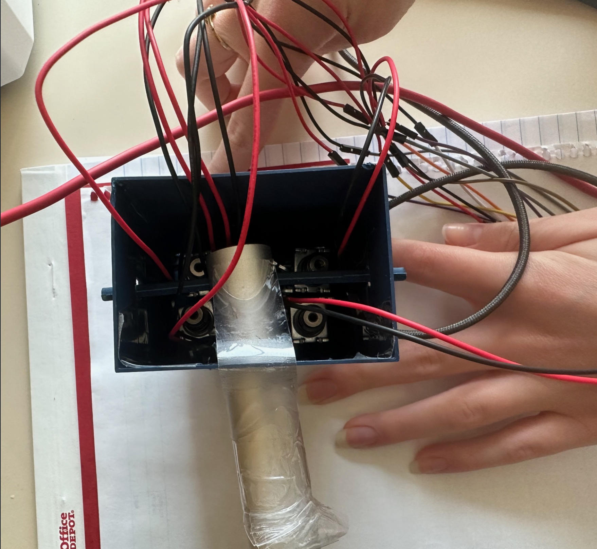
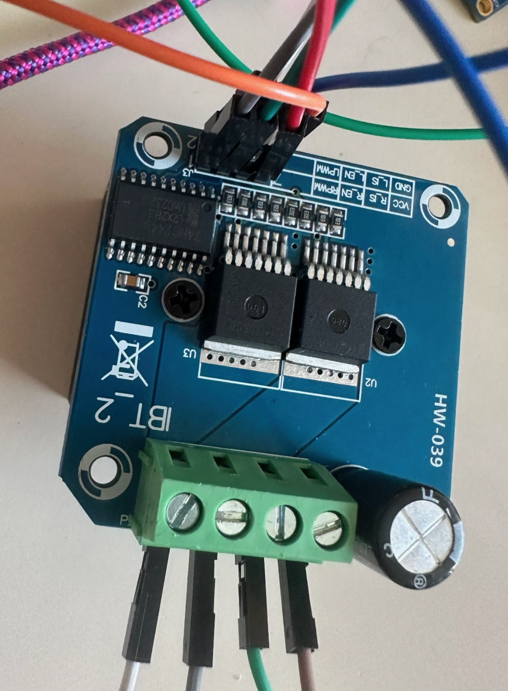
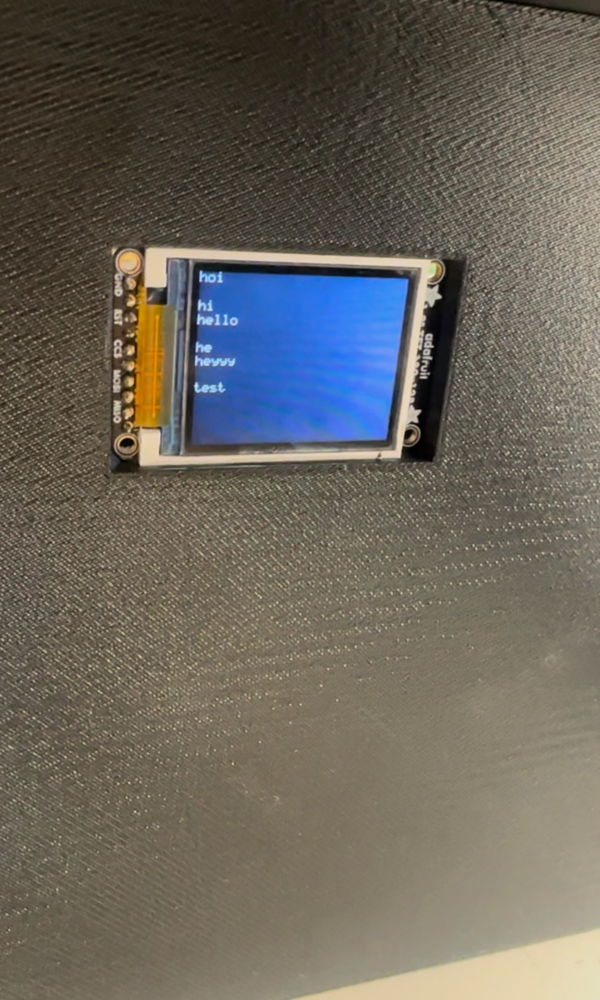
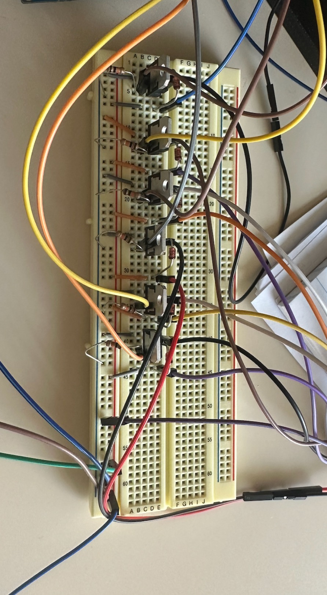
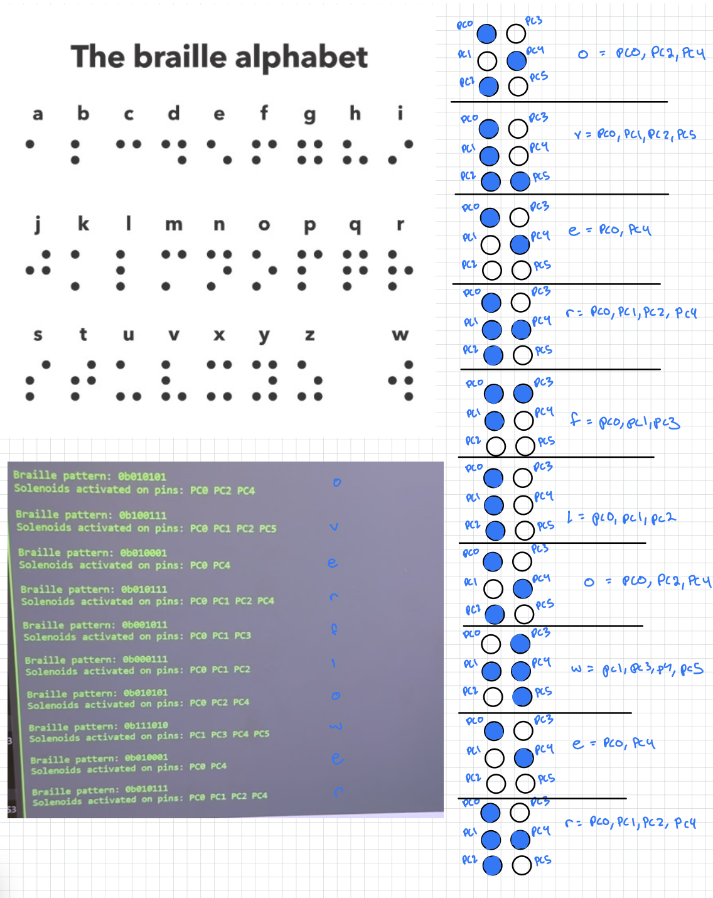

## Final Project Report

### 1. Video

Here is a [link](https://drive.google.com/file/d/1xeawdyDZGxui-g1Ykbre4UoAcS7RQmn_/view?usp=sharing) to our final project! :)

### 2. Images

  
  
    
  
  

### 3. Results

Our proposal was to make braille printing more accessible and cheaper. From our final implementation we could design a stamping machine responsible for translating our typed inputs from our phones  sent through the esp32 interface. We were able to build a functioning machine, which correctly related the inputs to the output pattern and activated solenoids responsible for stamping each respective character. Our linear actuator moves out after each letter is stamped and after a character count, when it reaches its maximum extended length, goes back in to restart and write on another line. We were able to implement both paths, having the actuator start unextended and move out, as well as having it move right to left (going from fully extended to its original length), which would be a more accurate representation of braille, since the stamping of the paper would happen upside down and required us to mirror all letters when accommodating the solenoids on their box.

We ran into a few problems when actually testing our stamp. We attached spike metals to the bottom of each solenoid, so that they would poke the paper. However, the light pressure of their stamps made it pretty hard to see what was being printed on paper. Therefore, we relied on print statements after every character to visualize the final output and compare the braille pattern  we observed in the activated solenoids to their actual representation.

#### 3.1 Software Requirements Specification (SRS) Results

| ID     | Description                                                                                                                                                                                                                                                                               |
| ------ | ----------------------------------------------------------------------------------------------------------------------------------------------------------------------------------------------------------------------------------------------------------------------------------------- |
| SRS-01 | The microcontroller will process each letter of the text input and connect it to its corresponding braille. We can test its accuracy by plugging in sample characters and evaluating the different outputs of the MCU.                                                                    |
| SRS-02 | The system will translate each recognized letter into a PWM signals sending specific rotation angle for the Braille stamp mechanism, ensuring accurate letter selection. In this phase, we can actually measure the rotation angle for each character once we have our stamper connected. |
| SRS-03 | The stamping should be precisely timed, ensuring that the stepper motor finishes its rotation completely before the stamp is pressed again to prevent misalignment.                                                                                                                       |
| SRS-04 | The linear actuator will move the stamping mechanism, positioning the stamp at the correct location on the paper. The actuator should only move the stamp after it is pressed.                                                                                                            |
| SRS-05 | The software will have debouncing to filter out noise from the keyboard.                                                                                                                                                                                                                  |

We could correctly program the firmware to recognize each character we put on the terminal and relate it to a specific braille pattern. We changed our implementation from using a rotation stamping moving up and down to a solenoid stamp, so we weren't required to implement PWM signals and used simply GPIO to control the activation of the solenoids and the linear actuator. In this case, instead of  measuring the precision of our design by having the right timing for the stepper and servo motor to move, we assured that our linear actuator started either fully extended or fully retracted at the beginning of each input and that it stopped when the solenoids were activated to stamp the paper and moved again after each character. We calculated the delay for separating each stamp and defined the maximum characters that would be in one line so that when that limit was reached the linear actuator would automatically go back to its initial placement.

For our serial communication requirement, we used SPI for the LCD screen, which displayed each character correctly as it was being stamped. We also implemented UART by connecting the ESP32 to the blynk app to capture the inputs out from our phone instead of only using only the serial terminal on our laptops.

Even though we were only physically connected to PD0 with the ESP32, we found that sharing the USART0 interface between application data (from the ESP) and debug output (sent from the mcu to the terminal) caused interference. Our most logical explanation is that the bidirectional UART, as well as its buffers and timing must be synchronized in showing and receiving inputs and outputs. In this case when the ESP and the terminal tried to send signals and display the output from the mcu,  sharing a single USART resource, the serial communication broke down. Disconnecting the ESP from PD0 resolved the issue, and allowed us to receive the inputs from the laptop again, confirming that PD0 was being affected logically by the shared UART, not electrically. However, since our main goal was to be able to use the blynk interface, we chose to keep the wire plugged in and make full use of the ESP, disconnecting the serial terminal from our browser. We were also able to implement interrupts instead of pooling to capture the signals sent by UART to the mcu, however this implementation proved a bit tricky because we believe our debug statements to have interfered with the communication, in a way that although the hardware worked, we were not able to prove the accuracy of our results through the statements. Therefore we moved back to our previous approach and got to observe the response for every input sent

Some of our requirements did change from the moment we decided to take the approach of using solenoids instead of a rotating stamping machine, like changing from pwm to GPIO, and adapting the movement of the linear actuator to the x-axis. At the end, we also changed a bit of our logic, testing whether we should have the actuator fully extended or not at first and how much it should be extended even at its lowest point to fit our Solidworks design.

*Validating requirements:*

| ID     | Description                                                                                                                                                                                                            | Validation Outcome                                                                                                                                                                                                                                                                                                                                                                                                    |
| ------ | ---------------------------------------------------------------------------------------------------------------------------------------------------------------------------------------------------------------------- | --------------------------------------------------------------------------------------------------------------------------------------------------------------------------------------------------------------------------------------------------------------------------------------------------------------------------------------------------------------------------------------------------------------------- |
| SRS-01 | The microcontroller will process each letter of the text input and connect it to its corresponding braille. We can test its accuracy by plugging in sample characters and evaluating the different outputs of the mcu. | Confirmed with print statements sent to the terminal and by showing the activation of each solenoid. Image below where you can see the output of "overflower" is correctly mapped to the braille representation that is then actuated by the solenoids.                                                                                                                                                              |
| SRS-04 | The linear actuator will move the stamping mechanism, positioning the stamp at the correct location on the paper. The actuator should only move the stamp after it is pressed.                                         | Confirmed by the output. Here is a[link](https://drive.google.com/file/d/1pdvOI0gqZwETCkLKmU1SOwnsVDpanDDl/view?usp=sharing) to the linear actuator moving after each character. It only moves while the solenoids are not being activated. For a space, just the linear actuator moves and the solenoids do not fire. At the end of the input, the linear actuator moves all the way back in to the original position. |

  

#### 3.2 Hardware Requirements Specification (HRS) Results

| ID     | Description                                                                                                                                                                                                                                                                       |
| ------ | --------------------------------------------------------------------------------------------------------------------------------------------------------------------------------------------------------------------------------------------------------------------------------- |
| HRS-01 | The device will require a keyboard module for text entry, this will communicate with the ATmega238 via PS/2.                                                                                                                                                                      |
| HRS-02 | It will also display the typed text to a LCD screen (I2C interface) to provide user feedback before printing. We will test the keyboard and the screen by seeing whether the later is displaying the correct keyboard inputs in real time.                                        |
| HRS-03 | The MCU will generate a PWM signal to control a stepper motor, which will rotate the Braille stamp mechanism to the correct character position. While working on this part we will ensure that the PWM signals are accurately rotating the stamp with a negligible error accuracy |
| HRS-04 | A linear actuator will move the stamp up and down to imprint the letters on to the paper A motor driver will be used to control the linear actuator, ensuring reliable movement without overloading the MCU.                                                                      |

Overall we achieved most of our goals, having the printer process inputs as expected and our actuator and solenoids move accordingly. We encountered some difficulty in controlling the pressure that the solenoids would be pressed in the paper, making it somewhat difficult to see the stamping outcomes. We 3D printed our structure supporting the linear actuator and with enough space to also hold the breadboards and wires, as well as a smaller box holding the solenoids. Our bigger box had a space for our LCD screen, which correctly showed each character being stamped through SPI. The thickness of our box was bigger than we expected so when we changed our code so that the actuator never moved fully back in. Even when starting at the most retrieved position, the actuator was already slight extended making sure that the solenoid box was still properly attached to it, we recalculated the space it should move after each character and made sure that the actuator was only active after the solenoids were activated to ensure precise stamping.

A few of our original ideas of implementation changed before we actually built the project. Following feedback from the professor, our first change was to use the serial terminal and UART communication from our own laptops as the inputs for the typed words.

Our initial idea also involved using a stepper motor to rotate a wheel machine which would move both horizontally and vertically to stamp each letter. From talking to our classmates we got feedback on how to simplify our mechanism using a set of six solenoids and our linear actuator to move horizontally on our paper and activate the precise solenoids to create the accurate letter. In this case, we were also able to work mainly with GPIO to activate the solenoids  instead of needing PWMs to rotate the wheel and could be more precise with the timing and spacing of the stamping.

On the practical side, we encountered a few issues in attaching a spike structure to the bottom of the solenoids and positioning them closer so that they would resemble a normal braille size. At the end, we were able to superglue pointy structures to the solenoids to punctuate the bottom of the paper, although the light pressure didn't allow us to strongly see the correct pattern on paper.

We powered our 12V components through a battery but ended up not using a buck converter to step it down to 5V. Instead we used the ATmega output for 5V, but still had to shift down the voltage to 3.3 using the level shifter so that we could connect the ESP32. The device might also not be considered portable due to the size of the main box, however it would be perfectly plausible for each household with a visually disabled person to acquire and learn how to use one for a fairly cheap price.

*Validating Requirements:*

| ID     | Description                                                                                                                                                                                                                                                                                    | Validation Outcome                                                                                                                                                                                                                                                                                                                                                                                                                                       |
| ------ | ---------------------------------------------------------------------------------------------------------------------------------------------------------------------------------------------------------------------------------------------------------------------------------------------- | -------------------------------------------------------------------------------------------------------------------------------------------------------------------------------------------------------------------------------------------------------------------------------------------------------------------------------------------------------------------------------------------------------------------------------------------------------- |
| HRS-02 | It will also display the typed text to a LCD screen (I2C interface) to provide user feedback before printing. We will test the keyboard and the screen by seeing whether the later is displaying the correct keyboard inputs in real time.                                                     | Confirmed as observed in video. Each character appears on the screen simultaneously as its being printed.Here is a[link](https://drive.google.com/file/d/1S9dsCvcRlnqZN1PVkVOyjlvBThYYR3gt/view?usp=sharing) to the video.                                                                                                                                                                                                                                  |
| HRS-04 | The motor will be mounted on a linear actuator, allowing it to move up and down (for stamping) and along the X-axis (for letter placement), working similarly to a plotter. A motor driverwill be used to control the linear actuator, ensuring reliable movement without overloading the MCU. | Partially confirmed. We used the linear actuator to move only in the x-direction, which worked precisely in timing and consistency with the motor driver. For the stamping up and down we used solenoids, connected and activated by the mcu and using diodes as a way to protect them from high voltages spikes as the motor turns off.  Here is a[link](https://drive.google.com/file/d/1oe5jddUY3IOjdkLFp_U5J3e_CTjTlkMo/view?usp=sharing) to the video. |

### 4. Conclusion

Our project went through many changes along the way, initially we thought of having a rotating stamp with alphabet characters and control two motors, a stepper motor through pwm to rotate the stamp and a servo motor through GPIO to move it up and down stamping the paper. By receiving feedback from the professor, the teaching team and our classmates we changed our implementation to receive the inputs directly from UART to the MCU and  created our braille pattern in solenoids which would automatically stamp the paper when activated, printing each letter.

This was one of our first times building an actual project from scratch and being responsible for all the design and implementation options. In the beginning, we were very cautious to understand what each component actually needed to do and how we would connect all elements both in hardware and software to reach our desired result. From software and hardware intersection in planning how to detect new inputs and activate our motors and solenoids precisely, to more hardware focused issues in finding an ideal battery for our 12V components and maximum current drawn, as well as building the structures to move our parts accordingly, and using solidworks to design the support for our components. We learned how to plan ahead and think of alternative solutions in case we forgot any small detail impacting our performance or had any pieces break or did not arrive in time.

Our final result was close to what we expected; we successfully implemented the UART for both our serial terminal and using the blynk application, which allowed us to type our inputs on our phones. We also were able to recognize each character and associate them to a pattern activating the solenoids through GPIO. And our actuator worked precisely after the stamps, leaving a standard space between each letter and going back to its original position at the start of each input, representing a new line. However, we encountered some problems with the actual stamp, while attaching structure to the bottom of the solenoids. Maybe a better solution would have been to print press fit structures and attach them to the solenoids, leading our spikes to the center of the solenoid holder so as to decrease the size of each character.

A next step for the project could be implementing another linear actuator responsible for moving in the y-direction, so that each new line would automatically start below the current one. In this case, we would have a real plotter stamping braille texts fully automatically. Another implementation would be scaling precisely the size of the characters by attaching structures to the bottom of the solenoids, centering the spiking stamps along the middle of the bottom of the solenoid box, making each stamp smaller and more realistic. In this case, the timing for extending the actuator would also change, so that the spacing between characters would be precisely scaled with their size. This would make the final machine more useful for actual applications by families or industries, being completely autonomous and standardized.

## References

LCD Library (Lab 4: Pong)
